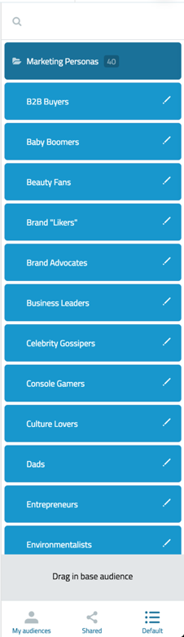

# Challenge: Elm

Hello! Welcome to the Elm Challenge.

This repository contains requirements definition of a project used for job applications
on a **position of an [Elm](https://elm-lang.org/) developer**.
The challenge consists of two parts, where **only the first part is required**.
The whole assignment is based on a real part of our production app.
However, since there is a lot of domain specific knowledge required for most parts of our system
and we are aware of the fact that most of this logic might be confusing to newcomers, we've tried to
pick a task which doesn't require any specific insight and removed all parts which might be possibly confusing to pick up.
Thanks to this, this project can be used as a general challenge to build an Elm app.

## Position Description

In its essence, GlobalWebIndex is a data company and our primary way how we deliver all our datasets to clients is the PRO Platform – our web application interface to our backend analytical engine.

Praised and used by the world's largest organizations, the PRO Platform enables our clients to cut through our data using custom audiences, segmentations and modular charting library.

You will be part of our PRO Platform team and will be jointly responsible for pushing the development of the platform forward.
Day-to-day this involves new feature engineering, reviewing and discussing code of your colleagues and discussing the design decisions with the wider technical leadership team.

- Ideate, brainstorm and implement new components and features using Elm.
- Develop the project codebase, with the focus on long-term maintenance – we look for people who really care about the quality as a day-to-day routine.
- Think forward and propose innovative approaches, which can push the project to the next level.
We like to discuss things so you’ll be expected to demonstrate conclusive arguments and get a buy in from the whole team.
- Evaluate external solutions (databases, frameworks, libraries), which might be beneficial to our platform.

## Basic Instructions

You are required to provide an implementation of a component for browsing `Audience`s and `AudienceFolder`s in a hierarchical structure.
Every `Audience` might or might not have a parent `folder` and every `Folder` might have (but not necessarily) its `parent` folder.
This means the component should display `n`-levels deep tree. Always one level at the time.
User can open any sub-folder or go back to the parent of the current level.
All data is provided in a JSON format.

**This is how a similar component looks like in our production system:**

## Introduction

There are two models: `Audience` and `AudienceFolder`, defined each with its own API endpoint.
You will find all the necessary data inside [/src/Data](/src/Data) folder. There is data in plain `JSON` format, which represents what API returns.
You will also find particular type definitions of each model. Your job is to deserialize this data into collection and build an interactive browser.

## General Acceptance Criteria

- The implementation must be done in the `Elm` language.
- You can use any 3rd-party library you want.
- `elm/html` must be used for rendering UI.
- You are free to use `ports` and `subscriptions` in case you want to.
- You can use [screenshot](/media/screenshot.png) as an inspiration for the UI or come up with your own layout if it satisfies the requirements.
- All naming including comments and additional documentation must be in English.
- The final result must be in the form of a full git repository with your own implementation.
- There are **no time restrictions** for completing this challenge.
- **Only the first part is required.**
- **In case you want to apply for the job, but have no time to finish the first step soon, let us know you're interested anyway.** (We are people too!)

## Where to Start

If you are interested in applying for this position or just want to challenge yourself (which is also 100% OK for us),
please continue following the steps:

- Fork this repository under your GitHub account.
- Complete an implementation inside your fork.
- Open pull request to [original](https://github.com/GlobalWebIndex/challenge-elm/) repository with your own implementation.
- Comment your pull request with message containing `READY` or `RDY` to let us know that we can review your code.
- Comment your PR with any question in case you need any help (or send us email - see below).

**You can also open a pull request before you finish the implementation in case you are willing to discuss anything!**

## Parts

- [First part](FIRST_STEP.md) - Browser Implementation
- [Second part](SECOND_STEP.md) - Filters Implementation

## Goal

The goal is to test your ability to come up with a solution for a real world problem which will be part of your day to day responsibility.
Obviously the first thing what we will look at is a degree to what your implementation satisfies original requirements.
Also we want to see your ability to come up with a robust solution and will look at the overall code quality.

## Contacts

In case you want to apply for a position in our team, please contact `engineering-recruitment@globalwebindex.com`.
If you have any questions about the implementation itself, you can send an e-mail to `asbernal@gwi.com`
or open issue/PR in this repository so we can discuss any part together.

## License

MIT
